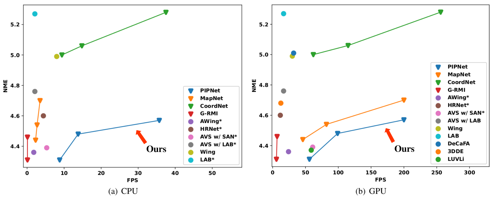
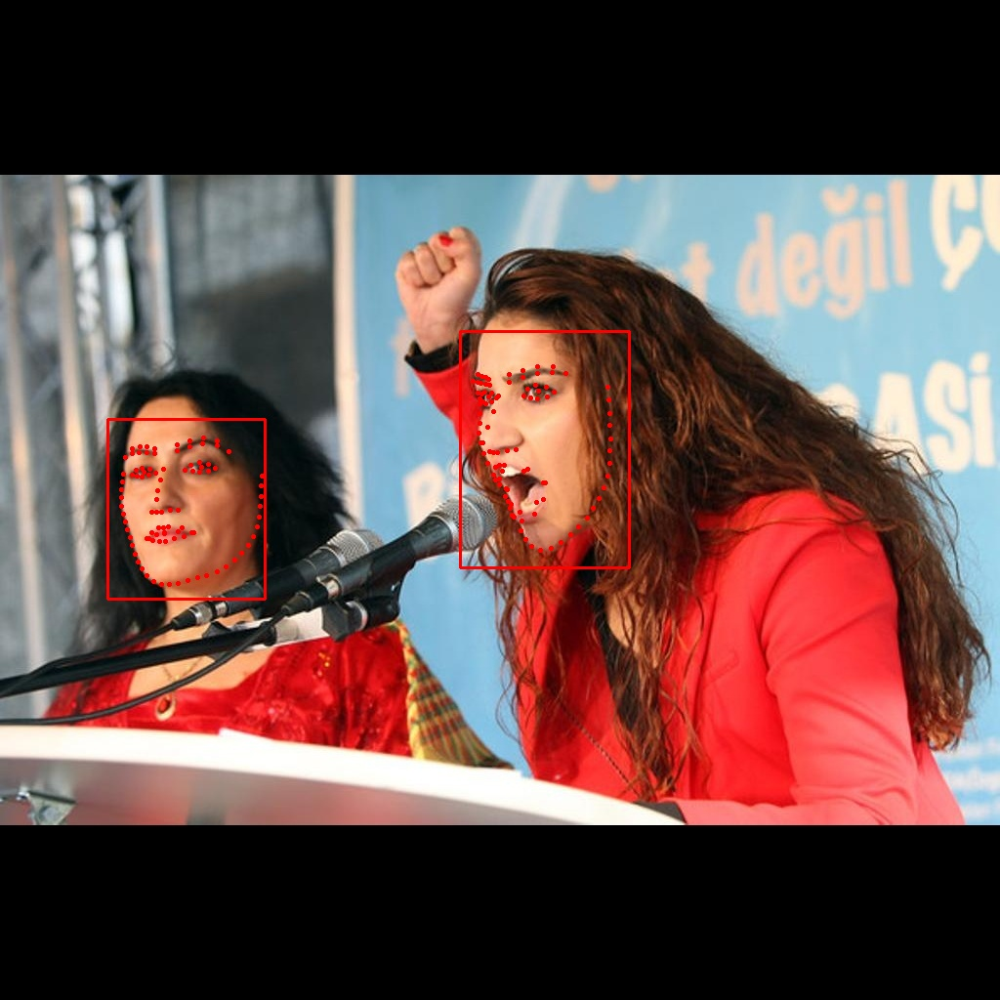

# Pixel-in-Pixel Net: Towards Efficient Facial Landmark Detection in the Wild
## Introduction
This is the code of paper [Pixel-in-Pixel Net: Towards Efficient Facial Landmark Detection in the Wild](https://arxiv.org/abs/2003.03771). We propose a novel facial landmark detector, PIPNet, that is **fast**, **accurate**, and **robust**. PIPNet can be trained under two settings: (1) supervised learning; (2) generalizable semi-supervised learning (GSSL). With GSSL, PIPNet has better cross-domain generalization performance by utilizing massive amounts of unlabeled data across domains. 


Figure 1. Comparison to existing methods on speed-accuracy tradeoff, tested on WFLW full test set (closer to bottom-right corner is better).<br><br>


Figure 2. Comparison of different detection heads.<br>

## Installation
1. Install Python3 and PyTorch >= v1.1
2. Clone this repository.
```Shell
git clone https://github.com/jhb86253817/PIPNet.git
```
3. Install the dependencies in requirements.txt.
```Shell
pip install -r requirements.txt
```

## Demo
1. We use a [modified version](https://github.com/jhb86253817/FaceBoxesV2) of [FaceBoxes](https://github.com/zisianw/FaceBoxes.PyTorch) as the face detector, so go to folder `FaceBoxesV2/utils`, run `sh make.sh` to build for NMS.
2. Back to folder `PIPNet`, create two empty folders `logs` and `snapshots`. For PIPNets, you can download our trained models from [here](https://drive.google.com/drive/folders/17OwDgJUfuc5_ymQ3QruD8pUnh5zHreP2?usp=sharing), and put them under folder `snapshots/DATA_NAME/EXPERIMENT_NAME/`. 
3. Edit `run_demo.sh` to choose the config file and input source you want, then run `sh run_demo.sh`. We support image, video, and camera as the input. Some sample predictions can be seen as follows.
* PIPNet-ResNet18 trained on WFLW, with image `images/1.jpg` as the input:


* PIPNet-ResNet18 trained on WFLW, with a snippet from *Shaolin Soccer* as the input:


* PIPNet-ResNet18 trained on WFLW, with video `videos/002.avi` as the input:


* PIPNet-ResNet18 trained on 300W+CelebA (GSSL), with video `videos/007.avi` as the input:


## Training

### Supervised Learning
Datasets: [300W](https://ibug.doc.ic.ac.uk/resources/facial-point-annotations/), [COFW](http://www.vision.caltech.edu/xpburgos/ICCV13/), [WFLW](https://wywu.github.io/projects/LAB/WFLW.html), [AFLW](https://www.tugraz.at/institute/icg/research/team-bischof/lrs/downloads/aflw/), [LaPa](https://github.com/JDAI-CV/lapa-dataset)

1. Download the datasets from official sources, then put them under folder `data`. The folder structure should look like this:
````
PIPNet
-- FaceBoxesV2
-- lib
-- experiments
-- logs
-- snapshots
-- data
   |-- data_300W
       |-- afw
       |-- helen
       |-- ibug
       |-- lfpw
   |-- COFW
       |-- COFW_train_color.mat
       |-- COFW_test_color.mat
   |-- WFLW
       |-- WFLW_images
       |-- WFLW_annotations
   |-- AFLW
       |-- flickr
       |-- AFLWinfo_release.mat
   |-- LaPa
       |-- train
       |-- val
       |-- test
````
2. Go to folder `lib`, preprocess a dataset by running ```python preprocess.py DATA_NAME```. For example, to process 300W:
```
python preprocess.py data_300W
```
3. Back to folder `PIPNet`, edit `run_train.sh` to choose the config file you want. Then, train the model by running:
```
sh run_train.sh
```

### Generalizable Semi-supervised Learning
Datasets: 
* data_300W_COFW_WFLW: 300W + COFW-68 (unlabeled) + WFLW-68 (unlabeled) 
* data_300W_CELEBA: 300W + CelebA (unlabeled)

1. Download 300W, COFW, and WFLW as in the supervised learning setting. Download annotations of COFW-68 test from [here](https://github.com/golnazghiasi/cofw68-benchmark). For 300W+CelebA, you also need to download the in-the-wild CelebA images from [here](http://mmlab.ie.cuhk.edu.hk/projects/CelebA.html), and the [face bounding boxes](https://drive.google.com/drive/folders/17OwDgJUfuc5_ymQ3QruD8pUnh5zHreP2?usp=sharing) detected by us. The folder structure should look like this:
````
PIPNet
-- FaceBoxesV2
-- lib
-- experiments
-- logs
-- snapshots
-- data
   |-- data_300W
       |-- afw
       |-- helen
       |-- ibug
       |-- lfpw
   |-- COFW
       |-- COFW_train_color.mat
       |-- COFW_test_color.mat
   |-- WFLW
       |-- WFLW_images
       |-- WFLW_annotations
   |-- data_300W_COFW_WFLW
       |-- cofw68_test_annotations
       |-- cofw68_test_bboxes.mat
   |-- CELEBA
       |-- img_celeba
       |-- celeba_bboxes.txt
   |-- data_300W_CELEBA
       |-- cofw68_test_annotations
       |-- cofw68_test_bboxes.mat
````
2. Go to folder `lib`, preprocess a dataset by running ```python preprocess_gssl.py DATA_NAME```.
   To process data_300W_COFW_WFLW, run
   ```
   python preprocess_gssl.py data_300W_COFW_WFLW
   ```
   To process data_300W_CELEBA, run
   ```
   python preprocess_gssl.py CELEBA
   ```
   and
   ```
   python preprocess_gssl.py data_300W_CELEBA
   ```
3. Back to folder `PIPNet`, edit `run_train.sh` to choose the config file you want. Then, train the model by running:
```
sh run_train.sh
```

## Evaluation
1. Edit `run_test.sh` to choose the config file you want. Then, test the model by running:
```
sh run_test.sh
```

## Community
* [lite.ai.toolkit](https://github.com/DefTruth/lite.ai.toolkit): Provide [MNN C++](https://github.com/DefTruth/lite.ai.toolkit/blob/main/lite/mnn/cv/mnn_pipnet98.cpp), [NCNN C++](https://github.com/DefTruth/lite.ai.toolkit/blob/main/lite/ncnn/cv/ncnn_pipnet98.cpp), [TNN C++](https://github.com/DefTruth/lite.ai.toolkit/blob/main/lite/tnn/cv/tnn_pipnet98.cpp) and [ONNXRuntime C++](https://github.com/DefTruth/lite.ai.toolkit/blob/main/lite/ort/cv/pipnet98.cpp) version of PIPNet.  
* [torchlm](https://github.com/DefTruth/torchlm): Provide a PyTorch re-implement of PIPNet with ONNX Export, can install with pip.

## Citation
````
@article{JLS21,
  title={Pixel-in-Pixel Net: Towards Efficient Facial Landmark Detection in the Wild},
  author={Haibo Jin and Shengcai Liao and Ling Shao},
  journal={International Journal of Computer Vision},
  publisher={Springer Science and Business Media LLC},
  ISSN={1573-1405},
  url={http://dx.doi.org/10.1007/s11263-021-01521-4},
  DOI={10.1007/s11263-021-01521-4},
  year={2021},
  month={Sep}
}
````

## Acknowledgement
We thank the following great works:
* [human-pose-estimation.pytorch](https://github.com/microsoft/human-pose-estimation.pytorch)
* [HRNet-Facial-Landmark-Detection](https://github.com/HRNet/HRNet-Facial-Landmark-Detection)
